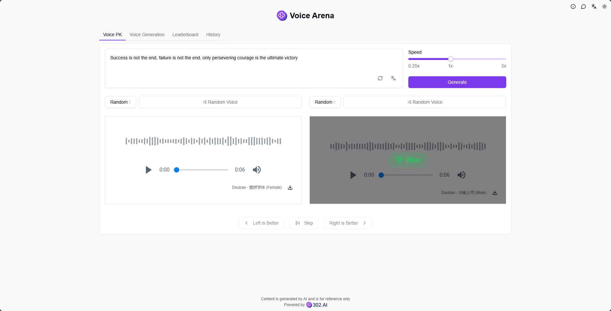

# <p align="center"> 🎙️ Voice Arena 🚀✨</p>

<p align="center">Voice Arena allows you to generate TTS (Text-to-Speech) using two AI voice models, either randomly or by selection, vote for the better model, generate personal rankings based on voting results, and provides features like voice-to-voice conversion and voice cloning to create your own customized voice models.</p>

<p align="center"><a href="https://302.ai/en/tools/voicearena/" target="blank"></a></p >

<p align="center"><a href="README_zh.md">中文</a> | <a href="README.md">English</a> | <a href="README_ja.md">日本語</a></p>


This is the open-source version of the [Voice Arena](https://302.ai/en/tools/voicearena/) from [302.AI](https://302.ai/en/). You can directly log in to 302.AI to use the online version with zero code and zero background, or modify and deploy it yourself according to your requirements.

## Interface Preview
In voice battles, you can randomly select or choose two voice models for text-to-speech generation, vote for the better model, and model names in random mode will be revealed after voting.      


Select voice models and set parameters, AI will generate speech based on input text, supporting batch generation.    
           

Select voice models and set parameters, AI will convert uploaded audio files or recordings into speech with the corresponding voice.   
        

Use customized voice models for text-to-speech generation to expand your voice library. 
    

Create custom voice models by uploading audio files or recordings.   
    

The system automatically generates personal model rankings based on user voting results.
    

All generated speech can be found in the history records.
   

## Project Features
### 🎙️ Multiple Model Support
Supports various TTS models, including but not limited to OpenAI, Azure, Doubao, etc.
### 📦 Batch Generation
- Single text, single voice
- Single text, multiple voices
- Multiple texts, single voice
- Multiple texts, multiple voices
### 🔄 Voice Conversion
Supports voice-to-voice conversion, converting any voice to target voice.
### 🎯 Voice Cloning
Quickly clone new voice models through voice samples.
### 📊 Vote Ranking
Generate voice model rankings based on user votes.
### 🌍 Multi-language Support
- Chinese Interface
- English Interface
- Japanese Interface

## 🚩 Future Update Plans
- [ ] Add emotion control features

## 🛠️ Tech Stack

- **Framework**: Next.js 14
- **Language**: TypeScript
- **Styling**: TailwindCSS
- **UI Components**: Radix UI
- **State Management**: Jotai
- **Form Handling**: React Hook Form
- **HTTP Client**: ky
- **i18n**: next-intl
- **Theming**: next-themes
- **Code Standards**: ESLint, Prettier
- **Commit Standards**: Husky, Commitlint

## Development & Deployment
1. Clone the project
```bash
git clone https://github.com/302ai/302_ai_drawing_prompt_word_expert
cd 302_ai_drawing_prompt_word_expert
```

2. Install dependencies
```bash
pnpm install
```

3. Configure environment
```bash
cp .env.example .env.local
```
Modify the environment variables in `.env.local` as needed.

4. Start development server
```bash
pnpm dev
```

5. Build for production
```bash
pnpm build
pnpm start
```

## ✨ About 302.AI ✨
[302.AI](https://302.ai/en/) is an enterprise-oriented AI application platform that offers pay-as-you-go services, ready-to-use solutions, and an open-source ecosystem.✨
1. 🧠 Comprehensive AI capabilities: Incorporates the latest in language, image, audio, and video models from leading AI brands.
2. 🚀 Advanced application development: We build genuine AI products, not just simple chatbots.
3. 💰 No monthly fees: All features are pay-per-use, fully accessible, ensuring low entry barriers with high potential.
4. 🛠 Powerful admin dashboard: Designed for teams and SMEs - managed by one, used by many.
5. 🔗 API access for all AI features: All tools are open-source and customizable (in progress).
6. 💡 Powerful development team: Launching 2-3 new applications weekly with daily product updates. Interested developers are welcome to contact us.
