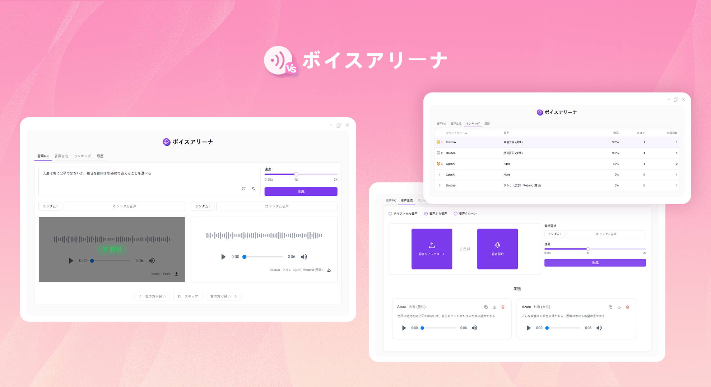
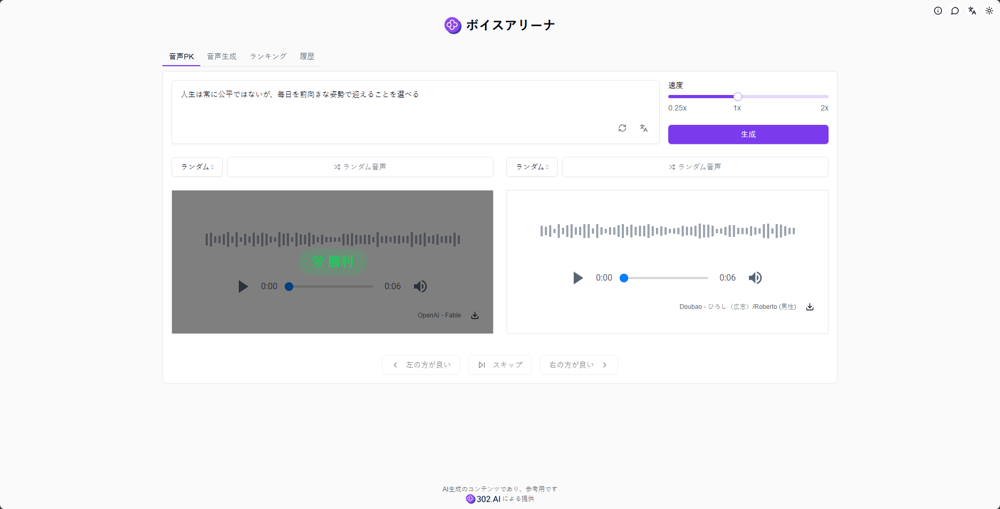
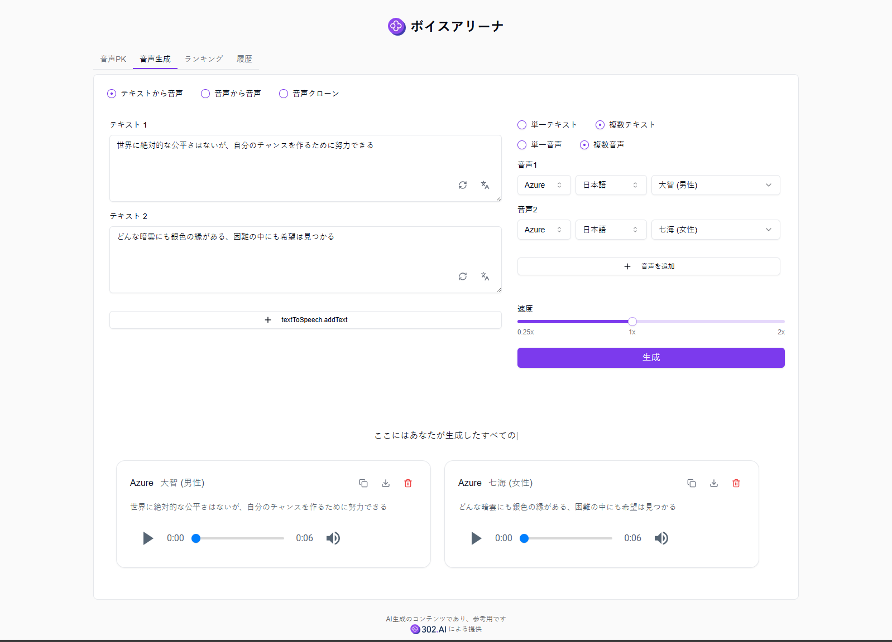
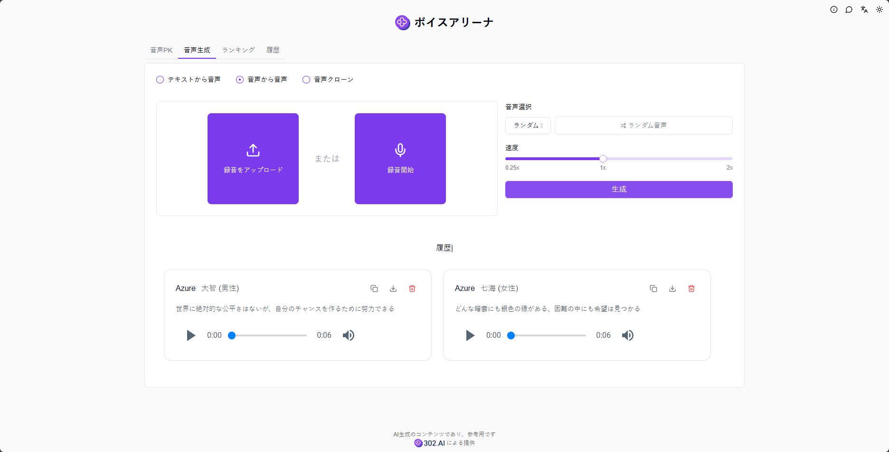
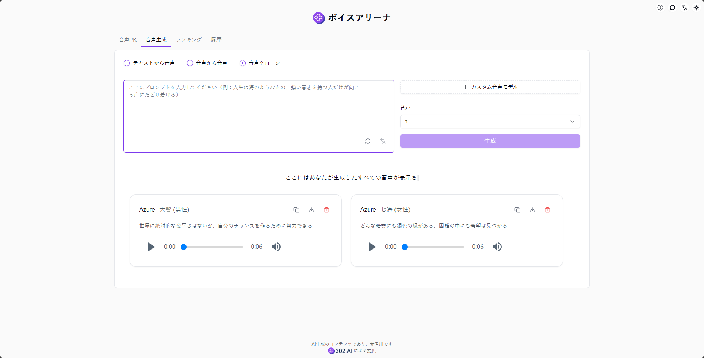
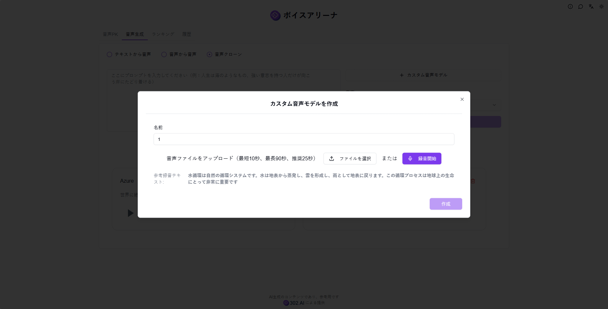
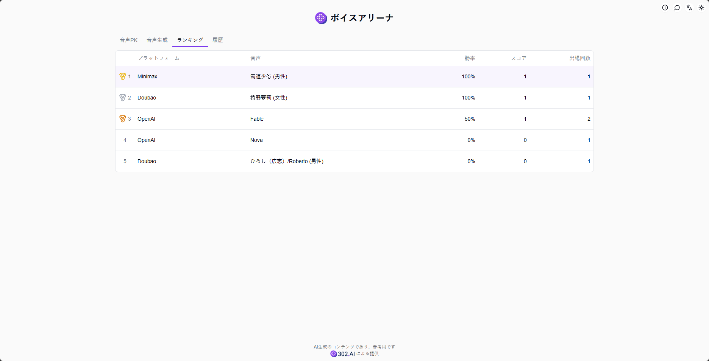
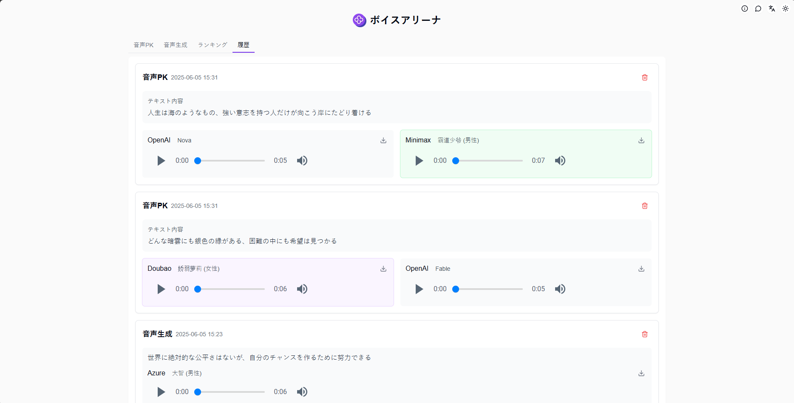

# <p align="center"> 🎙️ ボイスアリーナ 🚀✨</p>

<p align="center">ボイスアリーナでは、ランダムまたは選択した2つのAI音声モデルでTTS（テキスト音声合成）を行い、より良い効果のモデルに投票し、投票結果に基づいて個人ランキングを生成し、音声変換や音声クローニングなどの機能を提供して、あなた専用の音声モデルをカスタマイズできます。</p>

<p align="center"><a href="https://302.ai/product/detail/71" target="blank"></a></p >

<p align="center"><a href="README_zh.md">中文</a> | <a href="README.md">English</a> | <a href="README_ja.md">日本語</a></p>



[302.AI](https://302.ai/ja/)の[ボイスアリーナ](https://302.ai/product/detail/71)のオープンソース版です。
302.AIに直接ログインすることで、コード不要、設定不要のオンライン体験が可能です。
あるいは、このプロジェクトをニーズに合わせてカスタマイズし、302.AIのAPI KEYを統合して、自身でデプロイすることもできます。

## インターフェースプレビュー
音声バトルでは、ランダムまたは選択した2つの音声モデルでテキスト音声合成を行い、より良いモデルに投票できます。ランダムモードでのモデル名は投票後に表示されます。      


音声モデルを選択してパラメータを設定すると、AIが入力テキストに基づいて音声を生成します。一括生成にも対応しています。    
           

音声モデルを選択してパラメータを設定すると、AIがアップロードした音声ファイルや録音を対応する音声に変換します。   
        

カスタマイズした音声モデルを使用してテキスト音声合成を行い、音声ライブラリを拡張できます。 
    

音声ファイルや録音をアップロードするだけで、カスタム音声モデルを作成できます。   
    

ユーザーの投票結果に基づいて、システムが自動的に個人モデルランキングを生成します。
    

生成された音声はすべて履歴で確認できます。
                  

## プロジェクトの特徴
### 🎙️ マルチモデルサポート
OpenAI、Azure、Doubaoなど、様々なTTSモデルをサポートしています。
### 📦 一括生成
- 単一テキスト・単一音声
- 単一テキスト・複数音声
- 複数テキスト・単一音声
- 複数テキスト・複数音声
### 🔄 音声変換
音声から音声への変換をサポートし、任意の音声を目標の音声に変換できます。
### 🎯 音声クローニング
音声サンプルから新しい音声モデルを素早くクローン作成。
### 📊 投票ランキング
ユーザーの投票に基づいて音声モデルランキングを生成。
### 🌍 多言語サポート
- 中国語インターフェース
- 英語インターフェース
- 日本語インターフェース

## 🚩 将来のアップデート計画
- [ ] 感情制御機能の追加

## 🛠️ 技術スタック

- **フレームワーク**: Next.js 14
- **言語**: TypeScript
- **スタイリング**: TailwindCSS
- **UIコンポーネント**: Radix UI
- **状態管理**: Jotai
- **フォーム処理**: React Hook Form
- **HTTPクライアント**: ky
- **国際化**: next-intl
- **テーマ**: next-themes
- **コード規約**: ESLint, Prettier
- **コミット規約**: Husky, Commitlint

## 開発&デプロイ
1. プロジェクトのクローン
```bash
git clone https://github.com/302ai/302_ai_voice_arena
cd 302_ai_voice_arena
```

2. 依存関係のインストール
```bash
pnpm install
```

3. 環境設定
```bash
cp .env.example .env.local
```
必要に応じて`.env.local`の環境変数を修正してください。

4. 開発サーバーの起動
```bash
pnpm dev
```

5. プロダクションビルド
```bash
pnpm build
pnpm start
```

## ✨ 302.AIについて ✨
[302.AI](https://302.ai/ja/)は企業向けのAIアプリケーションプラットフォームであり、必要に応じて支払い、すぐに使用できるオープンソースのエコシステムです。✨
1. 🧠 包括的なAI機能：主要AIブランドの最新の言語、画像、音声、ビデオモデルを統合。
2. 🚀 高度なアプリケーション開発：単なるシンプルなチャットボットではなく、本格的なAI製品を構築。
3. 💰 月額料金なし：すべての機能が従量制で、完全にアクセス可能。低い参入障壁と高い可能性を確保。
4. 🛠 強力な管理ダッシュボード：チームやSME向けに設計 - 一人で管理し、多くの人が使用可能。
5. 🔗 すべてのAI機能へのAPIアクセス：すべてのツールはオープンソースでカスタマイズ可能（進行中）。
6. 💪 強力な開発チーム：大規模で高度なスキルを持つ開発者集団。毎週2-3の新しいアプリケーションをリリースし、毎日製品更新を行っています。才能ある開発者の参加を歓迎します。
