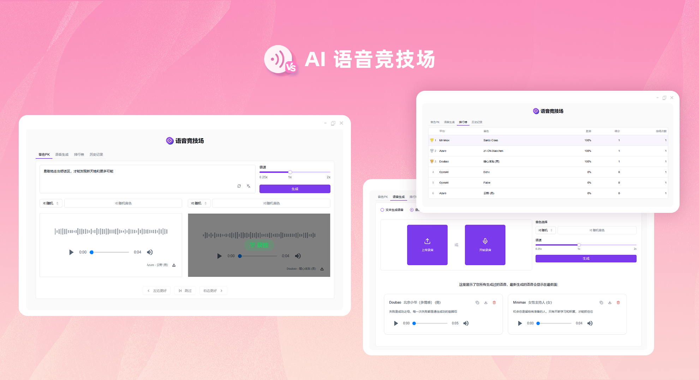
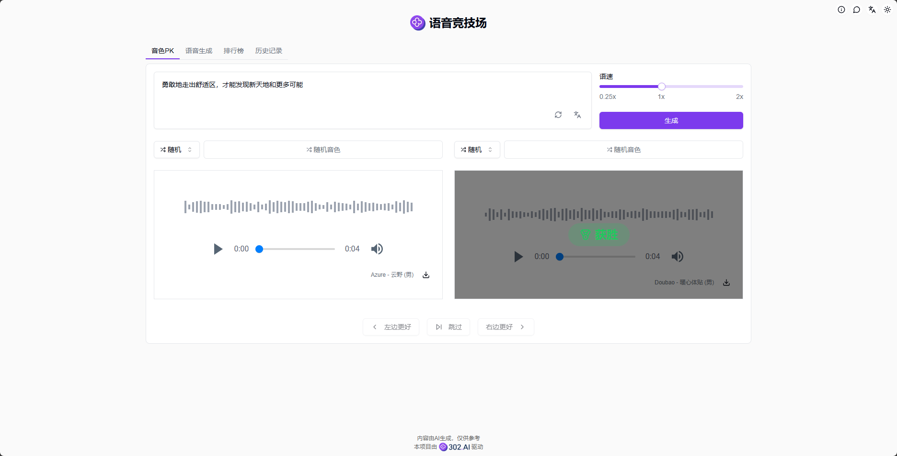
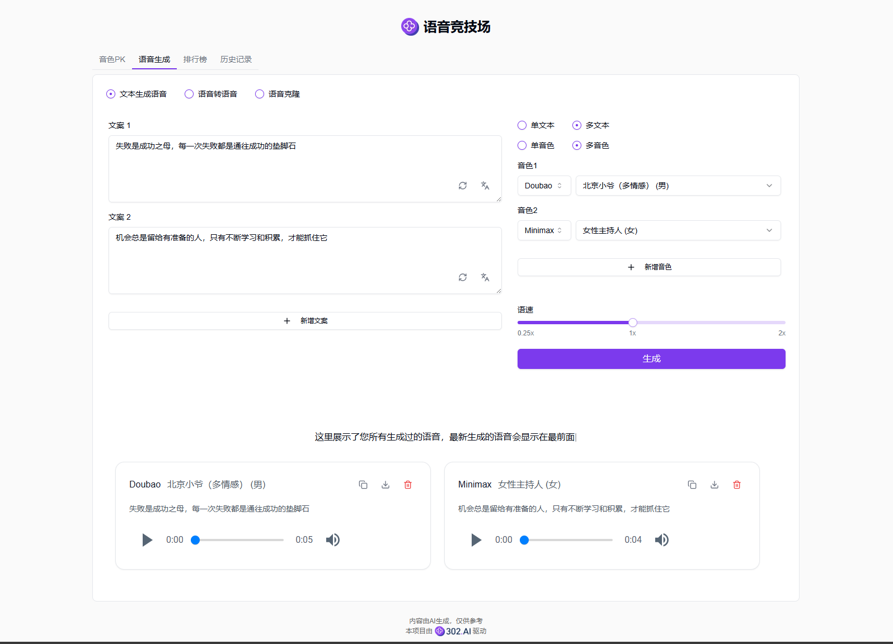
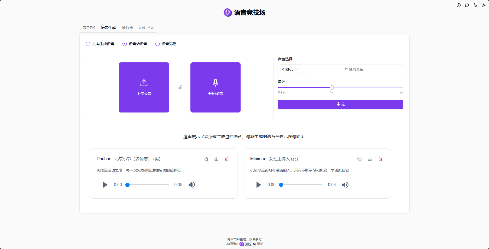
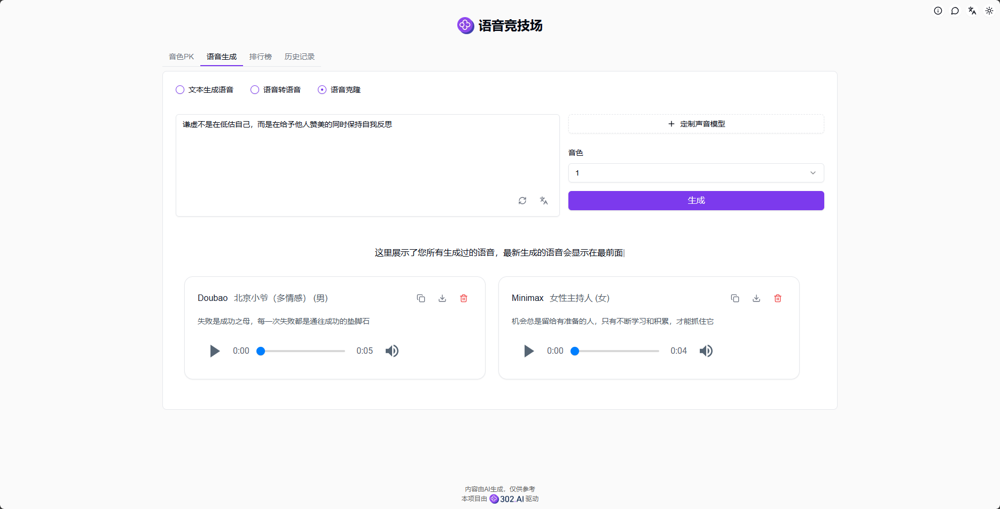
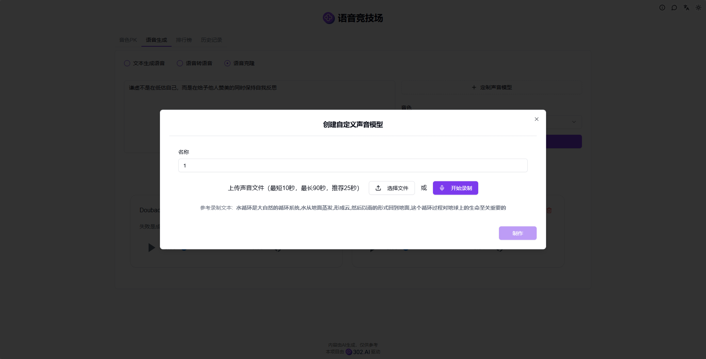
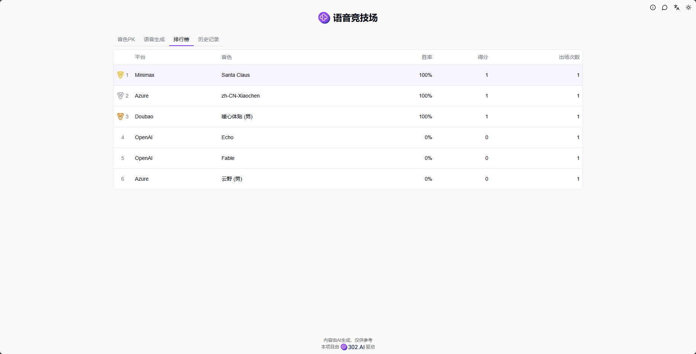
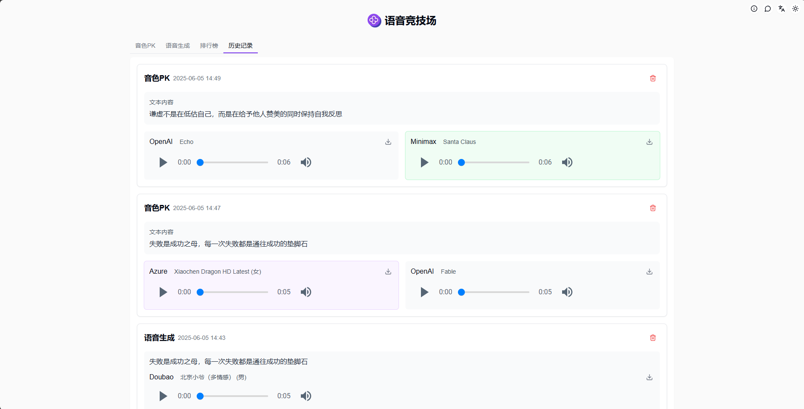

# <p align="center"> 🎙️ 语音竞技场</p>

<p align="center">语音竞技场通过随机或自选两个AI音色模型进行TTS(文字生成语音)，投票选择效果更佳的模型，根据投票结果生成个人排行榜，提供语音转语音、语音克隆等功能，定制专属于你的声音模型。</p>

<p align="center"><a href="https://302.ai/product/detail/71" target="blank"></a></p >

<p align="center"><a href="README_zh.md">中文</a> | <a href="README.md">English</a> | <a href="README_ja.md">日本語</a></p>



来自[302.AI](https://302.ai)的[语音竞技场](https://302.ai/product/detail/71)的开源版本。你可以直接登录302.AI，零代码零配置使用在线版本。或者对本项目根据自己的需求进行修改，传入302.AI的API KEY，自行部署。

## 界面预览
在音色PK中可以随机或自选两个音色模型进行文生语音，投票选出效果更佳的模型，随机模式下的模型名将在投票后展示。      


选择音色模型并设置参数，AI将根据输入的文本生成语音，支持批量生成语音。    
           

选择音色模型并设置参数，AI将根据上传的音频文件或录音转换成对应音色的语音。   
        

使用定制的声音模型进行文生语音，拓展您的音色库。 
    

通过上传音频文件或录音，即可创建自定义声音模型。   
    

根据用户的投票结果，系统会自动生成个人模型排行榜。
    

生成过的语音都可以在历史记录中找到。
    
 
## 项目特性
### 🎙️ 多模型支持
支持多种TTS模型，包括但不限于OpenAI、Azure、Doubao等。
### 📦 批量生成
- 单文本单音色
- 单文本多音色
- 多文本单音色
- 多文本多音色
### 🔄 语音转换
支持语音到语音的转换，可以将任意语音转换为目标音色。
### 🎯 音色克隆
通过语音样本快速克隆出新的声音模型。
### 📊 投票排名
基于用户的投票生成音色模型排行榜。
### 🌍 多语言支持
  - 中文界面
  - English Interface
  - 日本語インターフェース


## 🚩 未来更新计划
- [ ] 增加情感控制功能


## 🛠️ 技术栈

- **框架**: Next.js 14
- **语言**: TypeScript
- **样式**: TailwindCSS
- **UI组件**: Radix UI
- **状态管理**: Jotai
- **表单处理**: React Hook Form
- **HTTP客户端**: ky
- **国际化**: next-intl
- **主题**: next-themes
- **代码规范**: ESLint, Prettier
- **提交规范**: Husky, Commitlint

## 开发&部署
1. 克隆项目
```bash
git clone https://github.com/302ai/302_ai_voice_arena
cd 302_ai_voice_arena
```

2. 安装依赖
```bash
pnpm install
```

3. 环境配置
```bash
cp .env.example .env.local
```
根据需要修改 `.env.local` 中的环境变量。

4. 启动开发服务器
```bash
pnpm dev
```

5. 构建生产版本
```bash
pnpm build
pnpm start
```

## ✨ 302.AI介绍 ✨
[302.AI](https://302.ai)是一个按需付费的AI应用平台，为用户解决AI用于实践的最后一公里问题。
1. 🧠 集合了最新最全的AI能力和品牌，包括但不限于语言模型、图像模型、声音模型、视频模型。
2. 🚀 在基础模型上进行深度应用开发，我们开发真正的AI产品，而不是简单的对话机器人
3. 💰 零月费，所有功能按需付费，全面开放，做到真正的门槛低，上限高。
4. 🛠 功能强大的管理后台，面向团队和中小企业，一人管理，多人使用。
5. 🔗 所有AI能力均提供API接入，所有工具开源可自行定制（进行中）。
6. 💡 强大的开发团队，每周推出2-3个新应用，产品每日更新。有兴趣加入的开发者也欢迎联系我们
